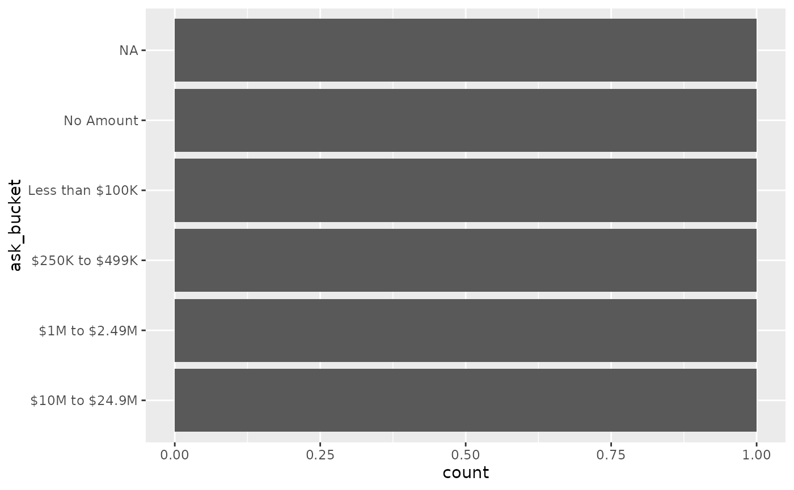

# Bucketing gift levels and rating levels

fundr includes reference tables for common gift/ask levels and wealth
rating levels, plus helpers to bucket numeric values into consistent
labels.

## Gift Level Bucketing

``` r
library(fundr)

x <- c(NA, 0, 1, 99999, 100000, 250000, 150000000)

bucket_gift_level(x, what = "giving_level")
#> [1] <NA>          No Amount     $.01+         $.01+         $100,000+    
#> [6] $250,000+     $150,000,000+
#> 14 Levels: $150,000,000+ < $100,000,000+ < $50,000,000+ < ... < No Amount
bucket_gift_level(x, what = "ask_bucket")
#> [1] <NA>            No Amount       Less than $100K Less than $100K
#> [5] $100K to $249K  $250K to $499K  $150M+         
#> 14 Levels: $150M+ < $100M to $149M < $50M to $99.9M < ... < No Amount
```

## Rating Level Bucketing

``` r
y <- c(NA, 0, 1, 9999, 10000, 250000, 100000000)

bucket_rating_level(y, what = "rating_level")
#> [1] <NA>               U - Unrated        N - Less than $10K N - Less than $10K
#> [5] M - $10K to $24K   I - $250K to $499K A - $100M+        
#> 15 Levels: A - $100M+ < B - $50M to $99.9M < ... < U - Unrated
bucket_rating_level(y, what = "rating_bucket")
#> [1] <NA>      Unrated   Annual    Annual    Annual    Major     Principal
#> Levels: Principal < Major < Mid-Level < Annual < Unrated
```

## Working with a Data Frame

Below is a base R example; these functions are also designed to work
well in `dplyr::mutate()` if you prefer tidy workflows.

``` r
df <- data.frame(
  donor_id = 1:6,
  ask_amount = c(0, 50000, 250000, 1200000, NA, 10000000),
  capacity_value = c(0, 8000, 250000, 5000000, 100000000, NA)
)

df$ask_bucket <- bucket_gift_level(df$ask_amount, what = "ask_bucket")
df$rating_bucket <- bucket_rating_level(df$capacity_value, what = "rating_bucket")

df
#>   donor_id ask_amount capacity_value      ask_bucket rating_bucket
#> 1        1    0.0e+00        0.0e+00       No Amount       Unrated
#> 2        2    5.0e+04        8.0e+03 Less than $100K        Annual
#> 3        3    2.5e+05        2.5e+05  $250K to $499K         Major
#> 4        4    1.2e+06        5.0e+06   $1M to $2.49M     Principal
#> 5        5         NA        1.0e+08            <NA>     Principal
#> 6        6    1.0e+07             NA  $10M to $24.9M          <NA>
```

## Optional: Plotting

``` r
ggplot2::ggplot(df, ggplot2::aes(x = ask_bucket)) +
  ggplot2::geom_bar() +
  ggplot2::coord_flip()
```


