# Visualization with fundr

fundr provides ggplot2-compatible themes, color palettes, and currency
scales for creating professional fundraising visualizations.

``` r
library(fundr)
library(ggplot2)
fundr_setup()
```

## Color Palettes

fundr includes named colors and three palettes designed for fundraising
reports.

### Named Colors

Access individual colors with
[`fundr_colors()`](https://mattfarrow1.github.io/fundr/reference/fundr_colors.md):

``` r
# See all available colors
fundr_colors()
#>         red       white       peach     magenta        teal        aqua 
#>   "#ff0000"   "#f2ebe7"   "#ff8d78"   "#933195"   "#00a8bf"   "#97c2a3" 
#> bright blue      violet        pink      purple       black        gray 
#>   "#327fef"   "#8c84e3"   "#ed86e0"   "#963ac7"   "#101921"   "#d0ced5" 
#>       brown      orange      yellow       green 
#>   "#7d3f16"   "#ed8c00"   "#f2ce00"   "#909b44"

# Get specific colors
fundr_colors("teal", "magenta", "peach")
#>      teal   magenta     peach 
#> "#00a8bf" "#933195" "#ff8d78"
```

### Palettes

Three palettes are available:

``` r
# Primary palette (2 colors)
fundr_palette("primary")
#> [1] "#ff0000" "#f2ebe7"

# Secondary palette (10 colors)
fundr_palette("secondary")
#>  [1] "#ff8d78" "#933195" "#00a8bf" "#97c2a3" "#327fef" "#8c84e3" "#ed86e0"
#>  [8] "#963ac7" "#101921" "#d0ced5"

# Tertiary palette (4 colors)
fundr_palette("tertiary")
#> [1] "#7d3f16" "#ed8c00" "#f2ce00" "#909b44"
```

### Visualizing the Palettes

``` r
# Create sample data
palette_demo <- data.frame(
  color = names(fundr_colors()),
  value = 1
)

ggplot(palette_demo, aes(x = color, y = value, fill = color)) +
  geom_col() +
  scale_fill_manual(values = fundr_colors()) +
  coord_flip() +
  theme_minimal() +
  theme(legend.position = "none") +
  labs(title = "fundr Color Palette", x = NULL, y = NULL)
```

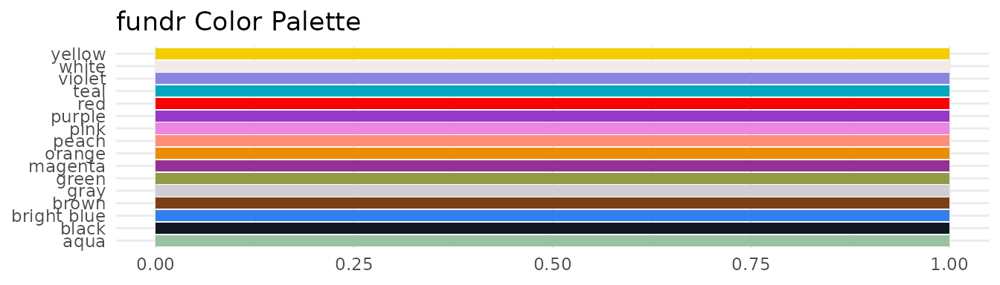

## Using Colors in Plots

### Direct Color Assignment

Use
[`fundr_colors()`](https://mattfarrow1.github.io/fundr/reference/fundr_colors.md)
to get hex codes for direct use:

``` r
# Prepare giving data
giving_by_status <- aggregate(
  total_giving ~ donor_status,
  data = fundr_portfolio[!is.na(fundr_portfolio$donor_status), ],
  FUN = sum,
  na.rm = TRUE
)

ggplot(giving_by_status, aes(x = donor_status, y = total_giving)) +
  geom_col(fill = fundr_colors("teal")) +
  scale_y_currency(short = TRUE) +
  labs(
    title = "Total Giving by Donor Status",
    x = "Donor Status",
    y = "Total Giving"
  ) +
  theme_minimal()
```

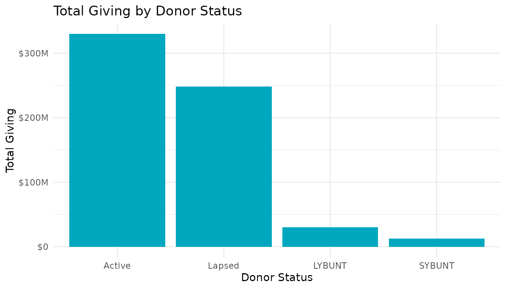

### Discrete Scales

Use
[`scale_fill_fundr()`](https://mattfarrow1.github.io/fundr/reference/scale_fill_fundr.md)
or
[`scale_colour_fundr()`](https://mattfarrow1.github.io/fundr/reference/scale_colour_fundr.md)
for categorical variables:

``` r
# Donors by region
region_counts <- as.data.frame(table(fundr_portfolio$region))
names(region_counts) <- c("Region", "Count")

ggplot(region_counts, aes(x = Region, y = Count, fill = Region)) +
  geom_col() +
  scale_fill_fundr(palette = "secondary") +
  labs(title = "Constituents by Region") +
  theme_minimal() +
  theme(legend.position = "none")
```

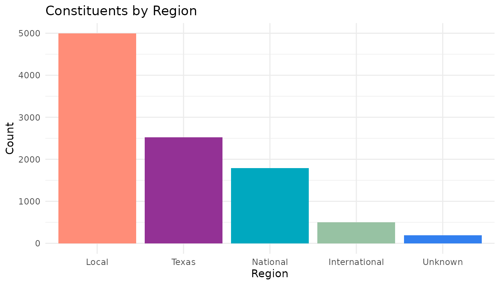

### Reversing Palette Direction

``` r
ggplot(region_counts, aes(x = Region, y = Count, fill = Region)) +
  geom_col() +
  scale_fill_fundr(palette = "secondary", direction = -1) +
  labs(title = "Constituents by Region (Reversed Palette)") +
  theme_minimal() +
  theme(legend.position = "none")
```

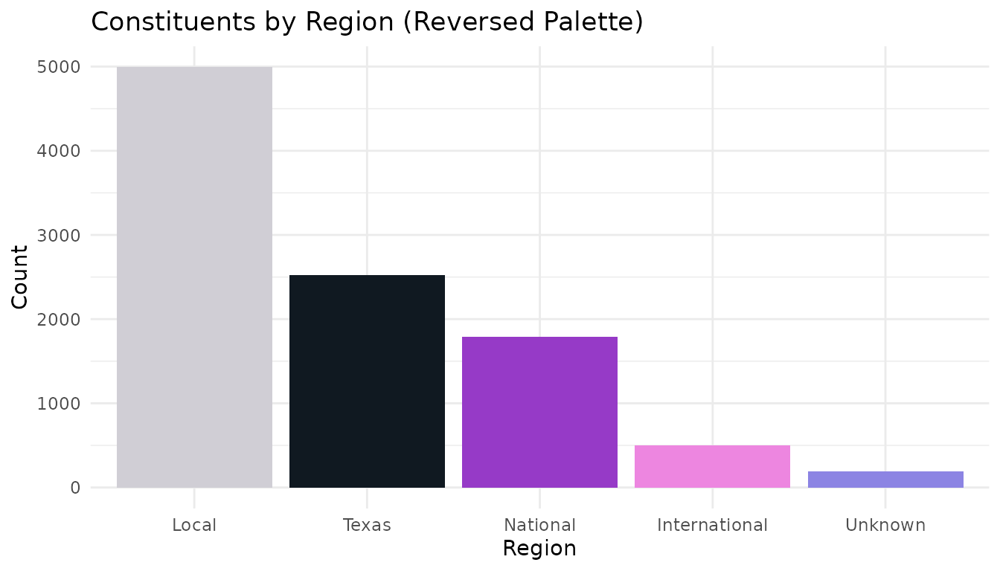

## Currency Scales

Format axis labels as currency with
[`scale_y_currency()`](https://mattfarrow1.github.io/fundr/reference/scale_y_currency.md)
and
[`scale_x_currency()`](https://mattfarrow1.github.io/fundr/reference/scale_x_currency.md):

### Full Format

``` r
# Top giving levels
top_donors <- fundr_portfolio[
  !is.na(fundr_portfolio$total_giving) & fundr_portfolio$total_giving > 50000,
]
top_donors <- top_donors[order(-top_donors$total_giving), ][1:10, ]

ggplot(top_donors, aes(x = reorder(constituent_id, total_giving), y = total_giving)) +
  geom_col(fill = fundr_colors("teal")) +
  scale_y_currency() +
  coord_flip() +
  labs(
    title = "Top 10 Donors by Total Giving",
    x = "Constituent ID",
    y = "Total Giving"
  ) +
  theme_minimal()
```

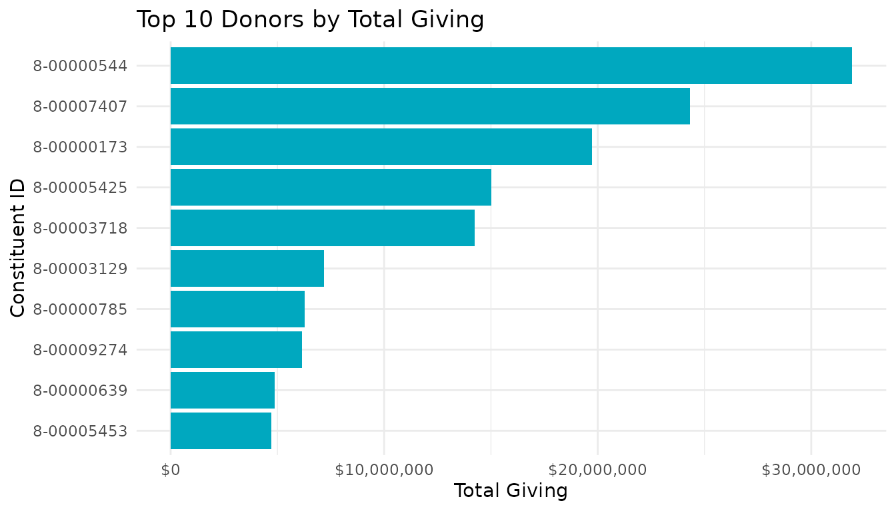

### Compact Format

Use `short = TRUE` for large values:

``` r
# Giving by status (larger scale)
ggplot(giving_by_status, aes(x = donor_status, y = total_giving)) +
  geom_col(fill = fundr_colors("magenta")) +
  scale_y_currency(short = TRUE) +
  labs(
    title = "Total Giving by Donor Status",
    x = "Status",
    y = "Total Giving"
  ) +
  theme_minimal()
```

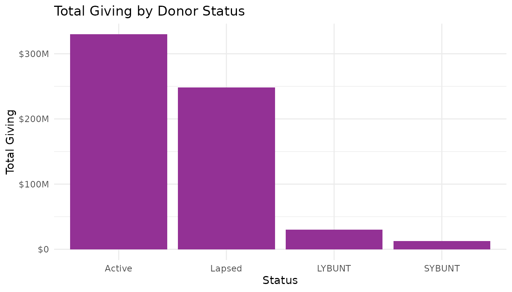

### Both Axes

``` r
# Scatter plot with currency on both axes
donors <- fundr_portfolio[!is.na(fundr_portfolio$first_gift_amount), ]
donors <- donors[sample(nrow(donors), 500), ]  # Sample for performance

ggplot(donors, aes(x = first_gift_amount, y = largest_gift_amount)) +
  geom_point(alpha = 0.5, color = fundr_colors("bright blue")) +
  scale_x_currency(short = TRUE) +
  scale_y_currency(short = TRUE) +
  labs(
    title = "First Gift vs. Largest Gift",
    x = "First Gift Amount",
    y = "Largest Gift Amount"
  ) +
  theme_minimal()
```

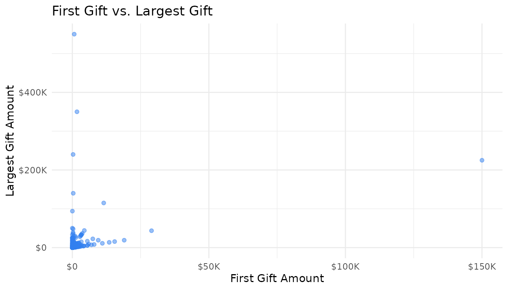

## The fundr Theme

[`theme_fundr()`](https://mattfarrow1.github.io/fundr/reference/theme_fundr.md)
provides a clean, minimal theme suitable for reports:

``` r
ggplot(giving_by_status, aes(x = donor_status, y = total_giving)) +
  geom_col(fill = fundr_colors("teal")) +
  scale_y_currency(short = TRUE) +
  labs(
    title = "Total Giving by Donor Status",
    subtitle = "All-time giving totals",
    caption = "Source: fundr_portfolio",
    x = NULL,
    y = "Total Giving"
  ) +
  theme_fundr()
```

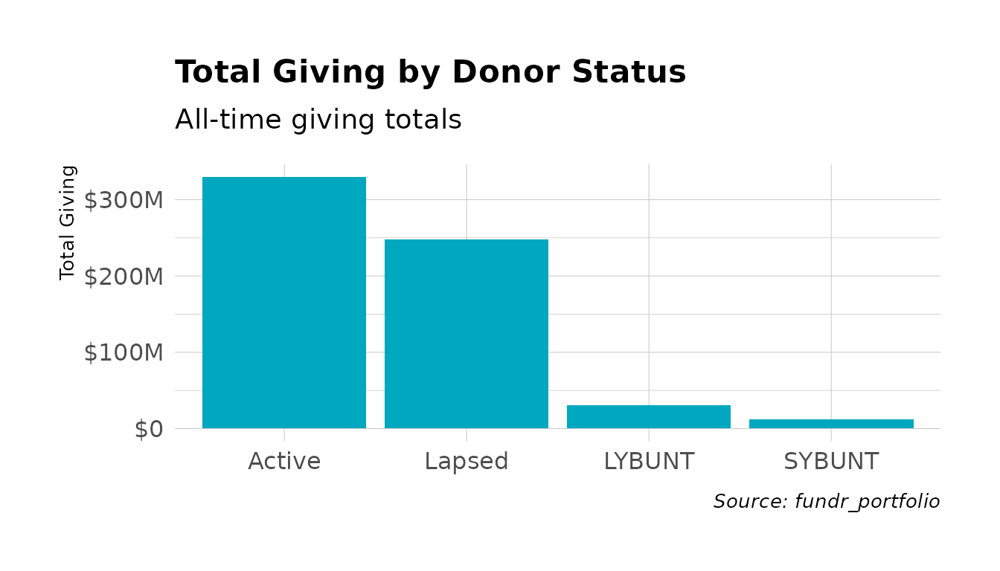

### Theme Customization

[`theme_fundr()`](https://mattfarrow1.github.io/fundr/reference/theme_fundr.md)
accepts many customization options:

``` r
ggplot(region_counts, aes(x = Region, y = Count, fill = Region)) +
  geom_col() +
  scale_fill_fundr(palette = "secondary") +
  labs(
    title = "Constituents by Geographic Region",
    subtitle = "Distribution across the portfolio"
  ) +
  theme_fundr(
    grid = "Y",           # Only horizontal grid lines
    axis = "x",           # Only x-axis line
    base_size = 11
  ) +
  theme(legend.position = "none")
```

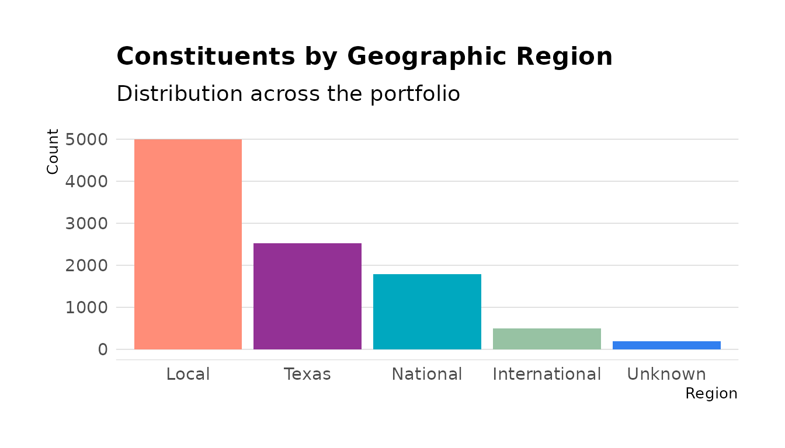

### Grid Options

Control which grid lines appear:

``` r
# All grid lines (default)
theme_fundr(grid = TRUE)

# No grid lines
theme_fundr(grid = FALSE)

# Only major Y grid
theme_fundr(grid = "Y")

# Major X and Y, minor y only
theme_fundr(grid = "XYy")
```

### Axis Options

Control which axes appear:

``` r
# No axis lines (default)
theme_fundr(axis = FALSE)

# Both axes
theme_fundr(axis = TRUE)

# Only x-axis
theme_fundr(axis = "x")
```

## Legend Helpers

### Moving Legend to Bottom

Use
[`legend_bottom()`](https://mattfarrow1.github.io/fundr/reference/legend_bottom.md)
for horizontal layouts:

``` r
# Prospect status by region
prospect_data <- fundr_portfolio[!is.na(fundr_portfolio$prospect_status), ]
status_region <- as.data.frame(table(
  prospect_data$region,
  prospect_data$prospect_status
))
names(status_region) <- c("Region", "Status", "Count")

ggplot(status_region, aes(x = Region, y = Count, fill = Status)) +
  geom_col(position = "dodge") +
  scale_fill_fundr(palette = "secondary") +
  labs(title = "Prospect Status by Region") +
  theme_fundr() +
  legend_bottom()
```

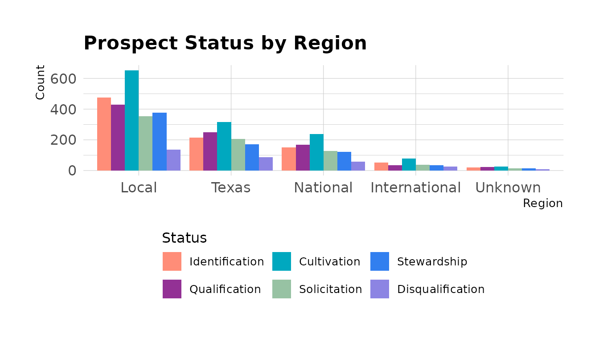

### Legend Position

Use
[`legend_position()`](https://mattfarrow1.github.io/fundr/reference/legend_position.md)
for other positions:

``` r
# Legend on right (default ggplot behavior)
+ legend_position("right")

# Legend on top
+ legend_position("top")

# No legend
+ legend_position("none")
```

## Complete Examples

### Giving Trend by Fiscal Year

``` r
# Get giving by fiscal year
donors <- fundr_portfolio[!is.na(fundr_portfolio$last_gift_date), ]
donors$last_fy <- fy_year(donors$last_gift_date)

fy_giving <- aggregate(
  total_giving ~ last_fy,
  data = donors,
  FUN = sum,
  na.rm = TRUE
)
fy_giving <- fy_giving[fy_giving$last_fy >= 2015, ]

ggplot(fy_giving, aes(x = factor(last_fy), y = total_giving)) +
  geom_col(fill = fundr_colors("teal")) +
  geom_text(
    aes(label = format_currency_short(total_giving)),
    vjust = -0.5,
    size = 3
  ) +
  scale_y_currency(short = TRUE, expand = expansion(mult = c(0, 0.1))) +
  labs(
    title = "Giving by Last Gift Fiscal Year",
    subtitle = "Total giving from donors whose last gift was in each FY",
    x = "Fiscal Year",
    y = NULL
  ) +
  theme_fundr(grid = "Y")
```

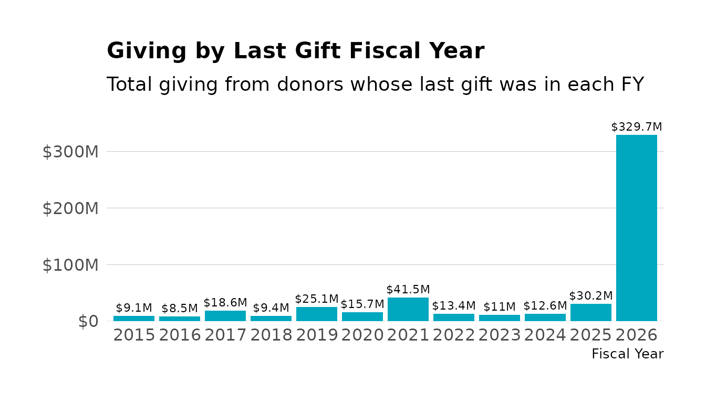

### Donor Pipeline

``` r
# Pipeline by prospect status
pipeline <- fundr_portfolio[!is.na(fundr_portfolio$prospect_status), ]

pipeline_summary <- as.data.frame(table(pipeline$prospect_status))
names(pipeline_summary) <- c("Stage", "Count")

ggplot(pipeline_summary, aes(x = Stage, y = Count, fill = Stage)) +
  geom_col() +
  scale_fill_fundr(palette = "secondary") +
  coord_flip() +
  labs(
    title = "Prospect Pipeline by Stage",
    x = NULL,
    y = "Number of Prospects"
  ) +
  theme_fundr(grid = "X") +
  theme(legend.position = "none")
```

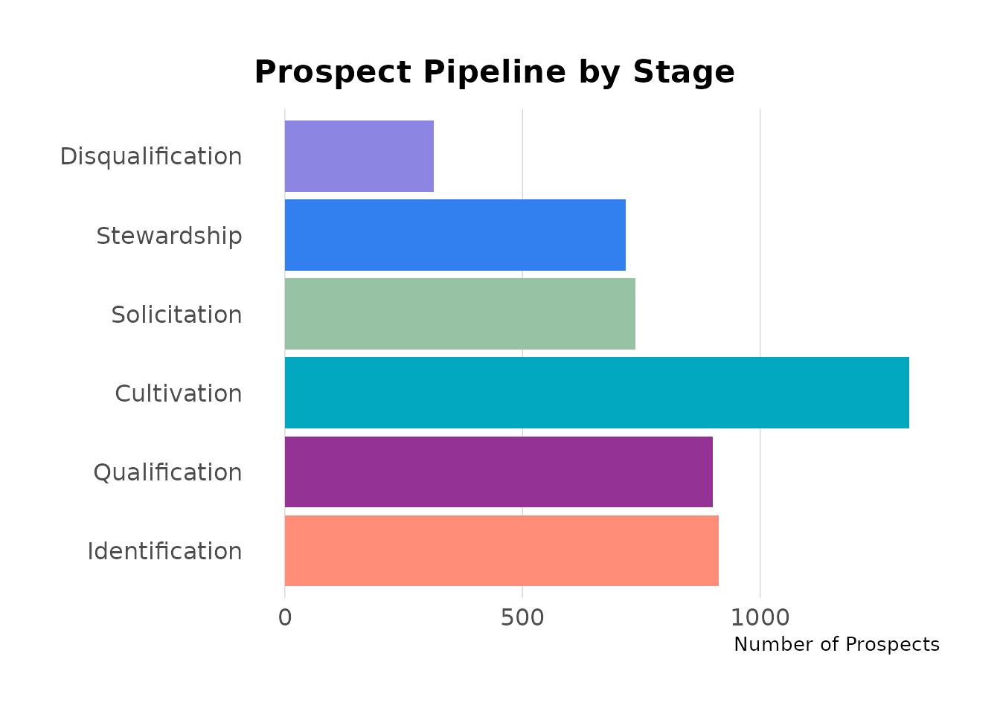

### Regional Giving Comparison

``` r
# Average total giving by region
regional_giving <- aggregate(
  total_giving ~ region,
  data = donors,
  FUN = mean,
  na.rm = TRUE
)

ggplot(regional_giving, aes(x = region, y = total_giving)) +
  geom_col(fill = fundr_colors("teal")) +
  scale_y_currency(short = TRUE) +
  labs(
    title = "Average Total Giving by Region",
    x = NULL,
    y = "Average Total Giving"
  ) +
  theme_fundr() +
  theme(axis.text.x = element_text(angle = 45, hjust = 1))
```

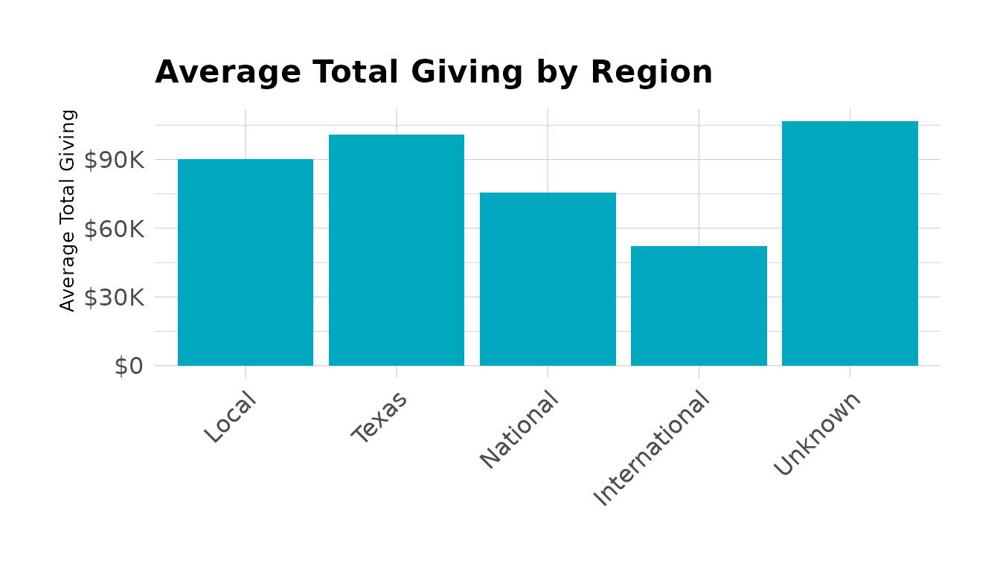

## Summary

| Function                                                                                      | Purpose                        |
|-----------------------------------------------------------------------------------------------|--------------------------------|
| [`fundr_colors()`](https://mattfarrow1.github.io/fundr/reference/fundr_colors.md)             | Access named hex colors        |
| [`fundr_palette()`](https://mattfarrow1.github.io/fundr/reference/fundr_palette.md)           | Get color vectors for palettes |
| [`scale_fill_fundr()`](https://mattfarrow1.github.io/fundr/reference/scale_fill_fundr.md)     | Discrete fill scale            |
| [`scale_colour_fundr()`](https://mattfarrow1.github.io/fundr/reference/scale_colour_fundr.md) | Discrete color scale           |
| [`scale_y_currency()`](https://mattfarrow1.github.io/fundr/reference/scale_y_currency.md)     | Format y-axis as currency      |
| [`scale_x_currency()`](https://mattfarrow1.github.io/fundr/reference/scale_x_currency.md)     | Format x-axis as currency      |
| [`theme_fundr()`](https://mattfarrow1.github.io/fundr/reference/theme_fundr.md)               | Minimal theme for reports      |
| [`legend_bottom()`](https://mattfarrow1.github.io/fundr/reference/legend_bottom.md)           | Move legend to bottom          |
| [`legend_position()`](https://mattfarrow1.github.io/fundr/reference/legend_position.md)       | Control legend position        |
